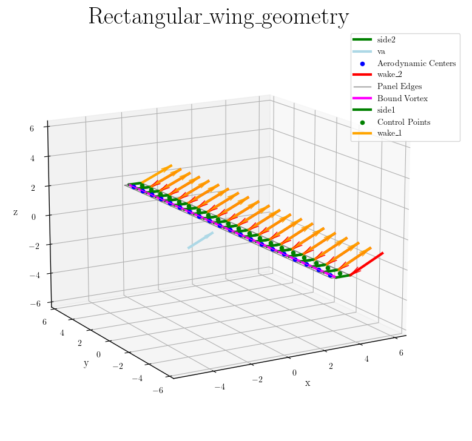

```@meta
CurrentModule = VortexStepMethod
```

## Wing Aerodynamics Analysis using Vortex-Step Method (VSM) and Lift Line Theory (LLT)
This example demonstrates the process of setting up and analyzing a wing's aerodynamics using VSM and LLT. We'll cover the following steps:
1. Importing necessary libraries.
2. Define the wing parameters
3. Create wing geometry with linear panel distribution and add the wing sections
4. Initializing the wing aerodynamics and set the inflow conditions.
5. Plotting the geometry
6. Initialize solvers for both LLT and VSM methods
7. Running an simulation with both methods
8. Plotting distributions
9. Plotting polars

#### Step 1: Importing the necessary libraries:
```julia
using LinearAlgebra
using ControlPlots
using VortexStepMethod
```

#### Step 2: Define wing parameters
```julia
n_panels = 20          # Number of panels
span = 20.0            # Wing span [m]
chord = 1.0            # Chord length [m]
v_a = 20.0             # Magnitude of inflow velocity [m/s]
density = 1.225        # Air density [kg/m³]
alpha_deg = 30.0       # Angle of attack [degrees]
alpha = deg2rad(alpha_deg)
```

#### Step 3: Create wing geometry with linear panel distribution
```julia
wing = Wing(n_panels, spanwise_panel_distribution=LINEAR)
```

##### Add wing sections - defining only tip sections with inviscid airfoil model
```julia
add_section!(wing, 
    [0.0, span/2, 0.0],    # Left tip LE 
    [chord, span/2, 0.0],  # Left tip TE
    INVISCID)
add_section!(wing, 
    [0.0, -span/2, 0.0],   # Right tip LE
    [chord, -span/2, 0.0], # Right tip TE
    INVISCID)
```

#### Step 4: Initialize aerodynamics
```
wa = BodyAerodynamics([wing])
```
We need to pass here an array of wing objects, because a body can have multiple wings.

###### Set inflow conditions
```julia
vel_app = [cos(alpha), 0.0, sin(alpha)] .* v_a
set_va!(wa, vel_app, [0, 0, 0.1])
```
#### Step 5: Plot the geometry
```julia
plot_geometry(
      wa,
      "Rectangular_wing_geometry";
      data_type=".pdf",
      save_path=".",
      is_save=false,
      is_show=true,
)
```
You should see a plot like this:



#### Step 6: Initialize solvers for both LLT and VSM methods
```julia
llt_solver = Solver(aerodynamic_model_type=LLT)
vsm_solver = Solver(aerodynamic_model_type=VSM)
```

#### Step 7: Solve using both methods
```
results_llt = solve(llt_solver, wa)
results_vsm = solve(vsm_solver, wa)
```

##### Print results comparison
```julia
println("\nLifting Line Theory Results:")
println("CL = $(round(results_llt["cl"], digits=4))")
println("CD = $(round(results_llt["cd"], digits=4))")
println("\nVortex Step Method Results:")
println("CL = $(round(results_vsm["cl"], digits=4))")
println("CD = $(round(results_vsm["cd"], digits=4))")
println("Projected area = $(round(results_vsm["projected_area"], digits=4)) m²")
```

#### Step 8: Plot spanwise distributions
```julia
y_coordinates = [panel.aero_center[2] for panel in wa.panels]

plot_distribution(
    [y_coordinates, y_coordinates],
    [results_vsm, results_llt],
    ["VSM", "LLT"],
    title="Spanwise Distributions"
)
```

#### Step 9: Plot polar curves
```julia
angle_range = range(0, 20, 20)
plot_polars(
    [llt_solver, vsm_solver],
    [wa, wa],
    ["LLT", "VSM"];
    angle_range,
    angle_type="angle_of_attack",
    v_a,
    title="Rectangular Wing Polars"
)
```